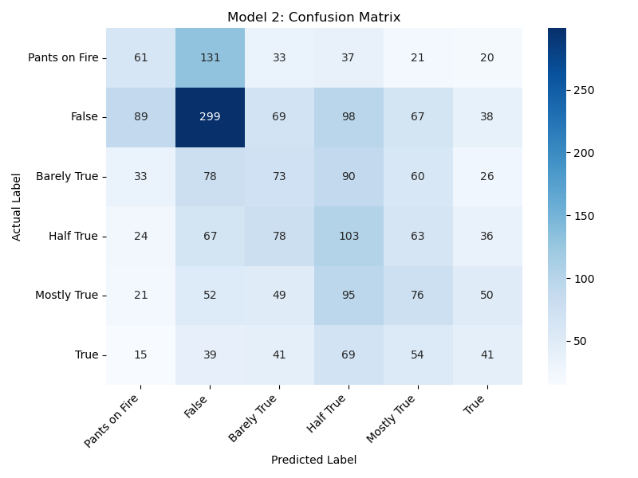

# ECE 684 / IDS 703 Natural Language Processing Final Project 

## NaN-Tastic Fact Checkers: Uncovering Truth in Headlines with Advanced Classification Techniques
### By: Ashley Hong, Nakiyah Dhariwala, Nruta Choudhari

### Table of Contents:
1. Introduction
2. Data Overview
3. Data Preprocessing
4. Model / Implementation
5. Analysis Plots
6. Conclusion

### 1. Introduction
This project focuses on classifying American political statements based on their truthfulness to combat misinformation, especially in the context of social media. The classification task categorizes statements as true, mostly true, half true, mostly false, false, or blatantly false (“pants on fire”). This is essential for fact-checking efforts and addressing the challenges misinformation poses to society.

Two machine learning approaches are explored in the project: a feedforward neural network (Model 1) and a BERT-enhanced classifier (Model 2). The document covers the architecture, preprocessing, and training methodologies of each model, along with performance evaluations. It also highlights challenges such as feature redundancy, overfitting, and class imbalance, comparing the effectiveness of traditional models versus more advanced, context-aware methods.

### 2. Data Overview
We made use of the [LIAR 2 dataset](https://paperswithcode.com/dataset/liar2), curated from PolitiFact, which is an extension of the original LIAR dataset and contains over 12,000 short statements that are labeled across six levels of truthfulness: true, mostly true, half true, mostly false, false, and pants on fire (indicating a blatantly false statement). The dataset also provides rich metadata for each statement, including details such as the speaker, the context of the statement, and the subject matter, making it highly suitable for short-text classification tasks.
What sets LIAR 2 apart is its incorporation of article context, where each statement is paired with the full context of the article it is derived from. This additional layer of information allows models to go beyond superficial text analysis and leverage deeper contextual insights, enhancing the accuracy of truthfulness classification. The dataset is particularly valuable for applications like fact-checking and misinformation detection, where understanding both the statement and its context is crucial.
It comes pre-divided into training, validation and testing files. We made use of the training dataset as a basis to train the model; the testing dataset to evaluate our results and chose our model; and finally, validation dataset to judge the final model.

|      Dataset      | Number of Rows (Input Rows) |
|:-----------------:|:---------------------------:|
| Training Dataset  |           18,369           |
| Testing Dataset   |           2,296            |
| Validation Dataset|           2,297            |

The columns of the dataset are as follows:
| **Column Name**        | **Description**                                                                 |
|:-----------------------:|:-------------------------------------------------------------------------------:|
| `id`                   | Unique identifier for each statement.                                           |
| `label`                | Ground truth label for the statement (e.g., true, false, half-true, etc.).      |
| `statement`            | The text of the statement being evaluated.                                      |
| `date`                 | The date when the statement was made or reported.                               |
| `subject`              | The main topic(s) or subject(s) of the statement.                               |
| `speaker`              | The individual or entity who made the statement.                                |
| `speaker_description`  | A brief description or title of the speaker (e.g., politician, public figure).  |
| `state_info`           | The U.S. state associated with the speaker (if applicable).                    |
| `true_counts`          | The count of statements made by the speaker that were classified as true.       |
| `mostly_true_counts`   | The count of statements made by the speaker that were classified as mostly true.|
| `half_true_counts`     | The count of statements made by the speaker that were classified as half-true.  |
| `mostly_false_counts`  | The count of statements made by the speaker that were classified as mostly false.|
| `false_counts`         | The count of statements made by the speaker that were classified as false.      |
| `pants_on_fire_counts` | The count of statements made by the speaker that were classified as "pants on fire" (extremely false). |
| `context`              | Additional context or setting where the statement was made.                     |
| `justification`        | Explanation or reasoning provided for the truthfulness evaluation.              |

The underlying distribution of labels from the three datasets are as follows:
Training Dataset:  

Testing Dataset:  

Validation Dataset:  

### 3. Model 1
**Custom Built Feed Forward Neural Network**
To classify textual data, we designed a feedforward neural network, optimized for multi-class classification tasks with high-dimensional vectorized features. The model preprocesses textual data by converting it into numerical representations using custom word2vec encoding. Missing values are replaced with the string `“None”`, and each column is vectorized differently. Text columns like `“statement”`, `“justification”`, and `“speaker description”` are tokenized and added to the vocabulary, while the `“subject”` column is processed based on semicolon delimiters to handle multiple subjects. For categorical columns like `“state information”`, `“speaker”`, and `“context”`, one-hot encoding is applied. Out-of-vocabulary tokens are mapped to a special token.

A custom SentimentDataset class was created to integrate the preprocessed data with PyTorch. This class processes the data, combines the features into a vector, and returns tensors for labels and training features. PyTorch’s DataLoader is used for batch processing, shuffling, and parallel data loading, which ensures efficiency during training and testing phases.

The neural network is structured with an input layer accepting feature vectors of size 85,446. This is followed by two hidden layers with 500 and 20 neurons, respectively, each utilizing Batch Normalization and ReLU activation for stable and accelerated training. The output layer has six neurons, representing the six truthfulness categories, with a Softmax activation to produce class probabilities. The model is trained using Cross-Entropy Loss and the Adam optimizer, with a learning rate of 0.001 and weight decay of 1e-3 to reduce overfitting.

The model was trained for 10 epochs using a batch size of 128 on a GPU, improving memory efficiency and ensuring stable training through batch processing. The Adam optimizer adapts the learning rate for each parameter, aiding in convergence while preventing overfitting.

### 4. Model 2
**Enhanced Classification with BERT and Refined Architecture**
In Model 2, we addressed the high dimensionality of input features from Model 1 by incorporating BERT for textual columns such as `“statement”`, `“justification”`, and `“speaker description”`. BERT’s tokenizer transformed these columns into 256-dimensional context-aware embeddings, reducing the vector size significantly compared to the one-hot encoding approach used in Model 1. For categorical columns, we used specialized vocabularies and vectorization, while maintaining one-hot encoding for columns like `“speaker”` and `“context”`.

The custom SentimentDataset class was enhanced for dynamic BERT tokenization, seamlessly integrating with PyTorch for efficient data handling. The updated FakeNewsClassifier combines BERT embeddings with vectorized outputs and processes them through four fully connected hidden layers, reducing dimensionality from 512 to 64 neurons, followed by a final output layer with six neurons and a Softmax activation. The model’s hyperparameters, including loss function, learning rate, batch size, and optimizer, were carefully selected to optimize performance.

### 5. Analysis Plots
**Model 1:**  

**Model 2:**  

### 6. Conclusion
While Model 2 integrated BERT embeddings for better context understanding, it faced challenges such as overfitting, difficulty in combining embeddings with other features, and misclassifications between adjacent classes. These issues hindered its performance compared to Model 1, which, despite its simpler architecture, showed better generalization and balanced results across categories. This suggests that simpler models and feature sets may be more effective for this task. To improve Model 2, future work will focus on addressing overfitting, fine-tuning the BERT embeddings, and managing class imbalances.